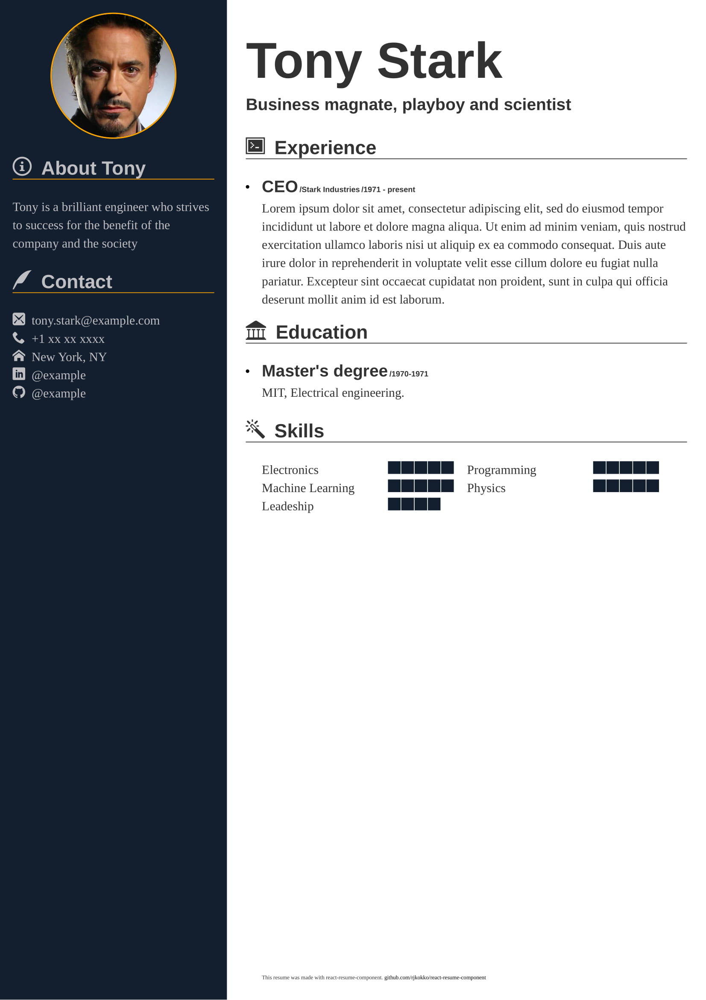

# react-resume-component

React resume component that can be used as an independent component of React application or as a generator for resumes.

## Getting started
```bash
npm install --save react-resume-component
```


```jsx
import React from "react";
import ReactDOM from "react-dom";
import Resume from "react-resume-component";
import profileImage from "./profile.jpg";

ReactDOM.render(
  <Resume
    name="Tony Stark"
    firstName="Tony"
    tel="+1 xx xx xxxx"
    email="tony.stark@example.com"
    address="New York, NY"
    linkedInAccount="@example"
    githubAccount="@example"
    profileImage={profileImage}
    summary="Tony is a brilliant engineer who strives to success for the benefit of the company and the society"
    profession="Business magnate, playboy and scientist"
    skills={[
      { name: "Electronics", level: 5 },
      { name: "Programming", level: 5 },
      { name: "Machine Learning", level: 5 },
      { name: "Physics", level: 5 },
      { name: "Leadeship", level: 4 }
    ]}
    experiences={[
      {
        company: "Stark Industries",
        period: "1971 - present",
        title: "CEO",
        description: (
          <div>
            <p>
              Lorem ipsum dolor sit amet, consectetur adipiscing elit, sed do
              eiusmod tempor incididunt ut labore et dolore magna aliqua. Ut
              enim ad minim veniam, quis nostrud exercitation ullamco laboris
              nisi ut aliquip ex ea commodo consequat. Duis aute irure dolor in
              reprehenderit in voluptate velit esse cillum dolore eu fugiat
              nulla pariatur. Excepteur sint occaecat cupidatat non proident,
              sunt in culpa qui officia deserunt mollit anim id est laborum.
            </p>
          </div>
        )
      }
    ]}
    education={[
      {
        school: "MIT",
        department: "Electrical engineering",
        degree: "Master's degree",
        period: "1970-1971"
      }
    ]}
    miscSection={
      <p
        className="description"
        style={{ position: "absolute", bottom: "0em", fontSize: "8px" }}
      >
        This resume was made with react-resume-component.
        <a href="https://github.com/rjkokko/react-resume-component.git">
          {" "}
          github.com/rjkokko/react-resume-component
        </a>
      </p>
    }
  />,
  document.getElementById("root")
);
```



See complete example [here](https://github.com/rjkokko/react-resume-component/tree/master/demo).